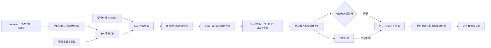

# 架构、协议与持久化契约

> **v1.7详细开发计划，已进入实施。** 生产提交统一采用Cookie初始化的Camoufox原生页面会话；独立HTTP和不同地区代理仅保留为协议测试证据，不能作为普通提交器或产品专用区域选项。代理统一通过现有通用代理管理保存 `node:<id>`/`group:<id>` 引用，并在新任务提交时解析出口。单文件多账号和多文件单账号的统一导入合同见[16](16-105账号Cookie批量导入与直协议复测.md)。

> 最新传输结论见[15](15-IPWO直协议与Camoufox-Cookie会话实测.md)：独立HTTP继续作为失败对照/实验能力；Camoufox page transport作为默认。官方滑块入口、回调、原生自动重发及T02-V仍按[13](13-滑块验证处理与会话恢复.md)实现，Canvas任务所有者受限弹层按[14](14-新账号HTTP复测与Canvas人工验证.md)保留为异常恢复能力。
本文中的 `dola` 文件、表和接口均为**拟新增设计**；现有函数会明确标为复用。当前真实 Dola Web 字段以06/10的证据和11的编译规则为准；完整脱敏body模板见10，运行时占位值不能直接发送。

## 1. 命名与服务边界

| 项目 | 决定 |
| --- | --- |
| 后台 section key / 页面文案 | `dolaApi` / `Dola API` |
| 默认系统渠道 ID / protocol ID | `dola` / `dola` |
| Provider 代理标识 | `dola`，加入现有 MagicProxyProvider 联合类型 |
| 逻辑视频模型示例 | `dola-seedance-2-5`、`dola-seedance-2-0-fast`，是拟定站内公开 ID；上游已观察 ID 分别为 `seedance_v2.5`、`seedance_v2.0` |
| 反代前缀 | `/api/dola/v1`，由本项目定义和维护 |
| 管理接口前缀 | `/api/admin/dola`，中文 `{code,data,msg}` 响应 |
| Python Provider | `services/dola-api/`，FastAPI + Playwright + 成熟 HTTP/SSE/签名库 |
| 水印处理 | `web/src/lib/server/dola/watermark-url.ts` + 持久render；可选本地修复才使用 `services/dola-watermark/` |
| 业务真源 | Next.js repository；PostgreSQL 与项目既有 JSON Provider 双后端 |
| 长任务真源 | 现有 `generation_tasks`；视频用 `video`，去水印用 `render` |

不能从普通用户请求接受 Dola URL、Cookie、代理密码、真实上游账号 ID 或可执行脚本。用户只选择站内逻辑模型和自己的资产。

## 2. 总体调用链



Web 服务负责全部数据库、权限、计费和公开状态。Provider 不单独维护另一套账号余额/业务任务数据库；它管理内存浏览器会话并提供受控传输。进程内缓存、正在执行请求映射只能加速，不能作为恢复真源。

为避免 Web 响应断开丢失提交确认，Provider 把重要事件提交到受限内部事件入口：`POST /api/internal/dola/attempts/:attemptId/events`。由 Web 原子写入 `dola_attempts/events` 后返回确认；事件携带 attemptId、leaseEpoch、单调 seq、允许的结构化字段。内部凭据仅可操作 Dola 的已分配 attempt，不能获得全站管理权限。直接调用客户端、重复事件、过期租约都拒绝。

Web 在发送 Sidecar 命令前先写入 `submitting`；Provider 在第一次发向 Dola 前通过受限 claim 入口核对 attempt 租约，CAS 记录 `dispatch_started`。一旦进入该状态，超时/重启不得自动再次发送创建请求。若 Dola 不提供幂等查询能力，崩溃窗口无法凭空实现 exactly-once；使用 `submission_unknown/needs_review` 保守恢复，不能通过重发掩盖。

## 3. Dola Web 协议适配

### 3.1 固定接口与动态协议的分离

本项目的 `/api/dola/v1/models` 是自己的受控目录，不是声称 Dola 官方存在 `/v1/models`。目录源为已验证的网页能力映射或管理员明确配置。不得在 `www.dola.com` 上猜模型列表路径。

Provider 将账号当前能力、模型映射和接口格式收敛成版本化 `DolaProtocolProfile`：

```ts
type DolaProtocolProfile = {
  revision: string;
  modelKey: string;                  // 站内 Provider 模型键
  publicLabel: string;
  upstreamModelId: string;           // 必须来自当前真实请求
  capability: 'text' | 'image' | 'video';
  durationOptions?: number[];        // 目标 [5, 10, 15, 30]
  aspectRatios?: string[];           // 每模型独立；本轮六档目标见 06 §6
  qualities?: string[];              // 没有真实支持就不发布
  referenceRoles: ('reference' | 'first_frame' | 'last_frame')[];
  maxReferenceImages?: number;       // 只有有证据的限制才配置
  transport: 'camoufox-page' | 'http-session';
  evidence: { source: 'observed' | 'verified' | 'manual'; caseIds: string[] };
};
```

此档案是参数与协议事实，不另建全站后台“探测/自动禁用渠道”机制。账号健康、管理员启用设置和已验证的能力范围分别表达。未验证的 15/30 可在明确标示的管理员实验测试中尝试；上游拒绝须透出事实，不能假装有稳定能力。完整发布须通过 R06。

两个视频模型各建一份 profile，目标比例均为 `1:1,3:4,4:3,9:16,16:9,21:9`；用户明确Fast上限15秒，目标离散时长 `5,10,15`；2.5独立为 `5,10,15,30`。Fast不提供30秒；服务端收到Fast>15秒的显式请求应报不支持，不静默截成15秒。当前能力主证据是 `/alice/slot/action_bar_v3/get_item_conf`，不能仅使用漏掉 2.5 的旧 skill pack。profile 还必须区分“菜单可见”“参数已提交”“成片已验证”；未取得媒体的 case 不能标为 verified。具体字段及真实 body 见 06 §3。

### 3.2 会话和传输

默认发布路径为 `camoufox-page`：在服务器隔离Camoufox持久context中加载该账号的Cookie授权状态，让真实页面完成会话初始化、上传、参数选择和签名提交；Provider监听当前page的SSE/响应并回传结构化事件。不能使用用户日常浏览器的整个Profile，也不能混用账号Cookie。具体运行键、页面阶段与一次点击合同见15 §5。

12/14/15已实测：直接Cookie导入独立HTTP客户端时，读取/上传通过而创建返回verify/slide；解析代理和台湾节点结果只作为区域差异样本。相同Cookie导入全新Camoufox context后，原生页面Fast5秒单图提交取得SSE_ACK且无滑块。正式使用`camoufox-page`，页面内部的正常HTTP由浏览器承载；`http-session`仅作为研究/失败对照，不暴露为普通提交路由。代理通过通用代理管理的 `node:<id>`/`group:<id>` 引用在提交前解析，任务从上传到查询固定同一代理快照；提交后不能因网络错误或滑块切换并重建任务。禁止复用硬编码设备ID、旧签名、固定UA或绕过服务端权限判定。

每个账号按管理员配置和已验证并发能力限制活动任务。BrowserContext 绑定 `accountId + credentialVersion + proxyTarget/proxyUrl`；一个任务从上传到下载保持同一账号与同一出口快照。账号凭据更新后新任务用新版本，已受理任务尽可能继续原会话；认证失效则暂停并等待重新授权。

### 3.3 视频请求编译

输入来自已解析的逻辑模型、最终时长、比例和有归属的参考资产，不接受浏览器直接指定内部 ability 内容。

以下是精简的设计模板，**不是可直接复制的完整请求**。本轮真实提交还带 `camera_movement` 和 `input_box_content`，见 06 §3.3；即使原生完整请求已成片，也不能由此认定删减后的最小字段集已经确定：

```json
{
  "client_meta": {
    "local_conversation_id": "<STABLE_LOCAL_ID>",
    "conversation_id": "",
    "bot_id": "<OBSERVED_BOT_ID>"
  },
  "messages": [{
    "local_message_id": "<STABLE_MESSAGE_ID>",
    "content_block": ["<OBSERVED_TEXT_AND_IMAGE_BLOCKS>"]
  }],
  "option": {
    "unique_key": "<STABLE_ATTEMPT_KEY>",
    "need_create_conversation": true
  },
  "chat_ability": {
    "ability_type": 17,
    "ability_param": "{\"ratio\":\"16:9\",\"model\":\"<VERIFIED_WIRE_ID>\",\"duration\":30}"
  }
}
```

步骤：

1. 服务端按逻辑模型找到 `dola` 渠道和模型档案，保存档案 revision。
2. 保留用户原文；后台默认文本模型按项目规则规划，得到内部执行提示词和公开 optimizedPrompt。只传执行所需文本至 Dola，不在用户消息中展示内部规划。
3. 使用 `resolveUpstreamVideoDuration` 和最终 `durationRange` 归一化并持久化 `requestedDurationSeconds`。按模型验证后分别写离散值：2.5为 `5,10,15,30`，Fast为 `5,10,15`；不能共用 `5-30`，也不能让Fast显式30秒自动变15秒。未实测的15秒保持未验证标记。
4. 保持项目尺寸优先级；精确宽高与比例分开保存。若 Dola 只接受比例，从用户尺寸推导比例但不得承诺精确像素或静默裁切。后台质量档位仅按当前真实 API 支持公开。
5. 取得账号与上传映射，编译文字块、图片块和引用关系，生成一次性的稳定 attempt 身份。
6. 发起一次创建，保存受理证据及上游会话/消息/任务 ID；SSE/查询只更新同一 attempt。
7. 成功结果按原字节保存；时长实测属于测试验收，不能在普通落盘路径二次转码或因轻微时长差异判失败。

需要单测的边界：能力为空；JSON 字符串与对象层级；中文 UTF-8；5/10/15/30；用户请求 12 秒按现有策略取 15；逻辑模型锁定后规划器不得换成其他渠道；上游拒绝 30 不可重发 10；缺失 model 映射返回明确配置错误。

### 3.4 图片引用与上传

图片不是公网 URL 字符串即可生效。完整映射为：

```text
Canvas 引用 token 的 nodeId
→ 服务器 Canvas/资产归属验证
→ storageKey + 内容哈希 + 引用序号/角色
→ 选定 Dola 账号
→ prepare_upload
→ ApplyImageUpload / 上传位置
→ 文件上传（及当前协议要求的 commit）
→ StoreUri / 资源 ID
→ 消息图片块 + prompt 引用结构
→ 同账号提交视频
```

本轮已确认 `POST /alice/resource/prepare_upload` 的 `tenant_id="5", scene_id="4", resource_type=2`，随后 imagex 主机的 `ApplyImageUpload` 与 `CommitImageUpload`，commit URI与10052附件块中的图片URI一致，且有 `pre_handle_v2_without_conv`。见06和 `evidence/live/image-upload.sanitized.json`；随后已从早前日志追回二进制POST（不是PUT），Content-CRC32八位十六进制与PNG的zlib CRC32一致，见09；Fast本次独立上传及新隔离环境签名仍需补证，不把早前样本混作新请求。STS 与上传认证仅在内存使用，不写日志。标准签名使用成熟库（优先复用已有 AWS SDK 能力/适用的 SigV4 库），CRC 使用成熟库；不得照抄手写底层算法。

站内输入与内部映射示例：

```json
{
  "prompt": "让 @[node:node_a] 中的产品沿桌面旋转，保持 @[node:node_b] 的背景配色",
  "references": [
    {"nodeId":"node_a","storageKey":"<OWNED_MEDIA_A>","role":"reference","ordinal":1},
    {"nodeId":"node_b","storageKey":"<OWNED_MEDIA_B>","role":"reference","ordinal":2}
  ]
}
```

Provider 实际编译用 `ordinal → uploadedResourceId`，不能把 `node_a` 发成上游资源 ID，也不能仅把“参考图1”写进 prompt。对上游引用语法未知时，必须先验证普通附图可用；若特殊 mention 不支持，明确能力边界，不能虚构 JSON 字段。

同一资产在同一账号/任务可复用一次上传；换账号必须重新检查上传资源归属，禁止把 A 的 StoreUri 用到 B。幂等键包含账号、凭据/协议版本、内容哈希及用途。资产读取经现有媒体所有权服务；签名 URL 只作短期传输，业务记录保存 storageKey。上传域名、重定向与文件类型使用项目安全出站/媒体限制契约。

首帧和尾帧仍用 `reference / first_frame / last_frame` 语义：只有实际协议证明相应角色可用才展示；缺帧、同图承担双角色或不支持的媒体类型提交前返回 422。不能从普通图片附件推断“首尾帧支持”。

### 3.5 SSE、查询和媒体结果

使用成熟 SSE parser，覆盖 UTF-8 字符跨 chunk、CRLF、多行 data、注释心跳、事件分片、重复/乱序和错误事件；不要逐网络 chunk 直接 JSON.parse。

适配器将已验证事件转换成 `accepted / progress / result / rejected / unknown`。参考视频结果有 `block_type=2074 → creation_block.creations → type=2 → video.download_url`，也有编码 main_url。只在已验证的字段路径中解析，不能递归抓任意 URL 当成成片。

查询必须用已存的 accountId、conversationId、messageId、upstreamTaskId，按实际需要组合；不使用账号“最近一条对话”，不把聊天说明或推荐视频识别为结果。多结果保存所有成功媒体及每份结果状态，不因单份失败丢弃其他成功项。

CDN 地址只能服务端获取；从 Dola 结果中读到的地址也要校验域名、重定向和响应类型。页面只拿站内稳定媒体地址。临时地址过期时用原任务刷新，不重生成。下载失败进入 `result_ready` 重试保存；HTML 错页、空文件和错误 MIME 不能登记为视频。

### 3.6 文本、视觉、生图

按当前 Dola 独立真实请求建立三个用例，复用同一个账号池和日志体系：

- 文本/流式文本：正确映射 messages，流结束和取消分开；禁止输出已经消耗的重复 SSE 文本。若无法恢复中途流，不换号从头再生成并拼到已返回流后面。
- 视觉理解：上传图片与图像块真实关联，文字/图片顺序保持；多轮上下文属于同一个 Dola 会话时绑定账号，不因轮询换号丢上下文。
- 生图/编辑：图片数、比例和质量用真实能力；若编辑未验证，返回不支持而不是退为文生图。多结果完整保存，前端只展示真实可用能力。

音频生成、音色、Google Search、embedding、moderation 不因“复刻页面”自动加入 Dola。若 Dola 后续实测有相应能力，另补独立契约，不返回占位数据。

## 4. 账号、额度与调度

### 4.1 导入与凭据

公开导入只支持Cookie Header：管理员可以粘贴完整Header，或上传一个/多个`.txt`/`text/plain` Cookie文件。单文件按非空行拆成多个账号，因此一个文件可以包含105条账号；多个文件逐文件解析，既支持每个文件一行，也支持文件内部多行。可选`Cookie:`前缀只按行去除，分号永远只分隔同一账号的Cookie，不能按分号拆账号。文件内容只作为数据解析，不能执行其中的文本、脚本或指令。Cookie JSON和Playwright storageState不出现在公开导入UI/API中。

预览显示文件数、条目数、每文件行数、解析Cookie数量、重复数和无效项，绝不回显值；提交返回逐项`created/updated/duplicate/invalid/needs_login/verification_required`及`sourceFileName/sourceOrdinal`。同一批次同一内容再次提交不生成重复账号；多个文件中的相同账号也只处理一次。使用稳定上游主体ID的HMAC做去重；尚未取得主体ID时用凭据HMAC临时去重，Camoufox无生成验证后原子合并同一主体，不能只按邮箱、文件名或显示名去重。

Cookie Header通过成熟库解析，原文只存在请求内存；凭据通过`encryptSecretValue`加密，读取通过服务层按需解密。JSON Provider同样存密文；普通列表不返回ciphertext。无有效加密密钥时拒绝保存。Provider只接收当前执行所需凭据，不能读取全站加密主密钥。Camoufox会话刷新后的Cookie集合通过专用受限接口回写新的密文版本；不保存上传文件路径，也不假设Cookie有固定寿命。

可选交互登录只在运行环境有真实可见登录窗口时开放。远程容器没有DISPLAY时使用Cookie粘贴/文本文件导入，不能声称“已在你的浏览器打开”。不存登录密码或TOTP。导入验证只恢复页面、主体和能力，不点击生成。

删除账号：禁止新调度，若还有运行/待核对任务则返回冲突并列出任务数，允许先停用、等待完成再删；保留脱敏历史统计关联，不删除用户已生成媒体。批量操作可部分成功，每条结果持久记录。

### 4.2 状态与额度口径

当前Camoufox基线没有触发挑战，但这不构成永久免验证承诺。出现挑战时使用13的官方流程和独立验证会话记录。官方页面successCb可能重发消息，故`resumeOwner=official-page/service`必须互斥；验证成功先核实原请求，不能直接触发Worker再次创建。

账号状态：`unverified / ready / needs_login / verification_required / quota_exhausted / rate_limited / restricted / disabled`。状态、人工 enabled、活动任务数、额度信息分别存储，不用一个“可用”布尔代替。

额度记录：bucket/model、单位、remaining、limit、resetAt、observedAt、source、version。没有数值就 null，UI 显示未知，不能 null→0；只观察到“5倍消耗”时显示相对消耗说明，不能推算剩余次数。多个单位/桶不相加。

“今日生成次数”来自本项目真实受理/成功账本；“上游剩余额度”来自上游；“本站积分”来自本项目计费，三者分列。统计日可用站点时区，上游 resetAt 必须用实际时区/时间戳；不能到上海零点就清除 quota_exhausted。

刷新触发：导入验证后、管理员单个/选中/全部刷新、收到明确额度事件后，以及有依据的调度刷新。批量刷新复用分页与配置并发；耗时操作返回 operationId 和真实进度，不靠前端假进度。

### 4.3 原子选择算法

1. 绑定用户/逻辑模型/请求身份并检查幂等；若是恢复，直接取原 attempt，不再选账号。
2. 查询已启用、模型/地区/会话能力匹配、未处于限制状态的候选账号，使用数据库过滤和排序。
3. 按管理员选择的 `round_robin` 或 `least_recently_used` 选候选；知道准确额度和成本时可采用 `quota_aware`，否则回退到上述顺序并显示额度未知。
4. 事务中锁定候选账号与配额桶，检查 `activeAttempts < maxConcurrent`；对已知足够额度预留真实单位，未知额度不写假数值。用 `FOR UPDATE SKIP LOCKED` 或既有 repository 的等价原子认领模式。
5. 写入 accountId/credentialVersion/proxyTarget、attempt、额度预留与租约，提交事务后才上传/发送上游。事务里不做网络调用。
6. 显式拒绝且确定未受理时释放预留；成功/明确上游扣量时结算；未知提交保持占用并等待核对。配额快照有 version，不能让较早刷新覆盖新扣量。
7. 列表无候选时业务任务保持等待或明确返回无可用账号，遵守管理员队列配置；不无限循环、不伪造成功。

重启后租约接管的是同一 attempt。租约到期只是允许恢复查询，不代表上游任务取消，也不能立即释放额度预留后再选账号创建。

### 4.4 换号与重试判定表

| 情况 | 自动选择其他账号 | 原任务动作 |
| --- | --- | --- |
| 提交前发现账号停用、过期、额度为零 | 可以 | 尚未受理；记录跳过原因 |
| 上传失败，确定未提交生成 | 可按错误类别选择；重新上传到新账号 | 沿用业务 requestId，记录新 attempt |
| 上游明确额度拒绝，证明确无受理 | 可以按本次需求切换正常可用账号 | 释放此预留；在同一业务任务追加 attempt |
| 超时/断网，不能确定是否受理 | 不可以 | `submission_unknown`，恢复确认，不再次 POST |
| 已得到上游任务 ID / 会话受理 ACK | 不可以 | 固定原账号查询 |
| HTTP200 + STREAM_ERROR710022004 + decision.verify/slide | 不自动换号或重发 | verification_required；待官方正常验证；extra.ack不是任务ACK；扣量未知 |
| 429 / 风控 / 地域 / 人机验证 | 不自动换号或换出口重复撞请求 | 记录限制、Retry-After 或需处理状态 |
| 参数或内容拒绝 | 不可以 | 给出明确错误，不重复计费尝试 |
| 上游明确终态失败 | 用户显式重试后才可选账号 | 保留业务任务/结果槽，增加 attemptNo |
| 上游成功、下载失败 | 不可以 | 仅更新链接/重新落盘 |
| 去水印失败 | 不可以 | 仅重试 render 子任务 |

这一表是对用户自动切换需求的具体实现。不能照搬参考项目“所有异常都重试生成”。上游既无明确 ACK 又无可关联查询时，进入待核对是正确行为。

## 5. 数据库与持久化设计

复用 `generation_tasks`、媒体登记、Canvas 项目、积分流水和现有审计表。新增下列 Dola 专有表，repository 放 `web/src/lib/server/database/`；字段名为设计约定，DDL 与 TypeScript/Python DTO 同步生成或逐项验证。

| 表 | 主要字段 | 索引/约束与用途 |
| --- | --- | --- |
| `dola_accounts` | id, name, subject_hash, credentials_ciphertext, credential_format, cookie_count, credential_version, runtime_transport, validated_at, last_session_started_at, enabled, status, last_used_at, max_concurrent, lease_state, created_at, updated_at | subject_hash unique；公开格式固定cookie_header、transport固定camoufox_page；enabled/status/last_used_at定向选择；不能保存明文Cookie或上传文件路径 |
| `dola_account_quotas` | account_id, bucket_key, model_key, unit, remaining numeric, limit_value numeric, reset_at, observed_at, source, version | PK(account_id,bucket_key)；null＝未知；来源只允许明确枚举 |
| `dola_settings` | id=default, gateway_enabled, rotation_enabled, rotation_mode, queue_config, watermark_auto_enabled, watermark_config, revision | 单例；保存后无缓存陈旧读；运行任务持有设置快照 |
| `dola_api_keys` | id, name, key_hash, prefix, created_by, enabled, expires_at, allowed_ips, allowed_models, request_count, last_used_at | key_hash unique；仅创建时返回 rawKey；发布外部路由权限与管理权限分离 |
| `dola_requests` | id, principal_type, principal_id, user_id, api_key_id, client_request_hash, request_fingerprint, generation_task_id, source, capability, logical_model_id, provider_model_key, status, settings_revision, created_at, completed_at | unique(principal_type,principal_id,client_request_hash)；指纹不一致 409；视频 generation_task_id 关联唯一业务任务 |
| `dola_attempts` | id, request_id, attempt_no, account_id, credential_version, protocol_revision, proxy_snapshot, state, upstream_conversation_id, upstream_message_id, upstream_task_id, quota_bucket, reserved_units, quota_settlement, lease_epoch, worker_id, lease_until, dispatched_at, accepted_at, completed_at, error_code | unique(request_id,attempt_no)；account/state、request_id 索引；查询 ID 精确匹配；敏感动态身份按需要加密 |
| `dola_request_events` | id, request_id, attempt_id, sequence, phase, code, public_detail, duration_ms, created_at | unique(attempt_id,sequence)；request_id/id 增量读取；详情白名单，无原始响应 |
| `dola_verifications` | id, account_id, attempt_id, credential_version, proxy_target_snapshot, context_id, provider_instance_id, lease_epoch, state, resume_owner, challenge_fingerprint, challenge_ciphertext, upstream_expires_at, policy_expires_at, controller_user_id, control_lease_hash, control_lease_until, version, created_at, updated_at, completed_at | attempt_id unique；account/state定向查询；私有挑战加密；验证成功不等于任务受理；完整合同见13 §5 |
| `dola_operations` | id, type, requested_by, selection_snapshot, total, completed, status, item_results, created_at, updated_at | 批量导入/刷新/删除进度；选中集合冻结、按页推进；大明细用分页记录而非一次响应全量 |

请求日志列表以 `dola_requests` 联合必要的当前 attempt/汇总投影实现，详情按页查询 events；不要复制一整套全量 JSON 到前端过滤。若 operation 明细规模超过现有单记录资源契约，拆 `dola_operation_items`，不能临时增加前端输出上限截断结果。

代理设置优先扩展现有 `magic_proxy_settings`/通用代理 bindings 的 `dola` 字段及对应 mapper，不再建第二套代理节点库。账号实际出口只保存安全标签和 revision，代理认证由既有加密设置解析。

额度 `numeric` 参数赋值、比较和算术统一显式 `$n::numeric`；测试至少包含 1.5 单位。所有更新带版本/锁条件，额度预留释放与 attempt 状态在同一事务。统计按时间窗/账号/模型/来源 SQL 聚合，失败尝试与成功业务请求分母分开。

JSON Provider 复用 `data-adapter` 文件锁和原子写入，保存同样结构和密文；不能用浏览器 localStorage/IndexedDB。文件后端遵守现有单部署约束，不宣称跨宿主机分布式锁等价 PostgreSQL。

`schema.ts` 增加新设计，不写旧 Dola 数据迁移兜底。同步 `docs/backend-database.md` 与正式文档站 `docs/content/docs/backend/backend-database.mdx`，并核对数据库备份/恢复 allowlist。凭据只进入受控灾备，不进入普通业务 JSON 导出。

## 6. 管理 API 契约

全部要求 Session + `upstream.manage`，管理员测试是本次用户明确需求，对 Dola 入口实施；不改变全站“模型渠道”页面的测试策略。请求体限制复用现有配置与资源保护契约，错误不得带 Cookie/Token/堆栈。

| Method + 相对路径 `/api/admin/dola` | 输入 | 返回/语义 |
| --- | --- | --- |
| GET `/` | 无 | 配置、服务健康、脱敏概览；账号列表另分页 |
| GET `/accounts` | page,pageSize,keyword,status | items,total；账号额度与更新时间 |
| POST `/accounts/import` | accounts[{clientItemId,name,cookieHeader}]；operationRequestId；仅Cookie Header | 同步结果或明确accepted+operationId；公开结果不含Header、Cookie名值或ciphertext |
| PATCH `/accounts/:id` | name,enabled,maxConcurrent | 更新后的公开账号 |
| POST `/accounts/:id/refresh` | requestId | 登录/额度状态，不触发生成 |
| POST `/accounts/refresh` | selection={mode:all/ids,ids?,filter?} | 冻结选择的批量进度 |
| DELETE `/accounts/:id` | 无 | 有活动任务时 409；成功后立即回读消失 |
| POST `/accounts/batch-delete` | selection,operationRequestId | 批量结果；界面先确认 |
| GET `/verifications`、`/verifications/:id` | accountId,state,cursor | 脱敏挑战状态及关联请求；完整定义见13 §5 |
| 验证会话操作及帧流 | open/input/close/reconcile/resume各自独立POST路由，frames为GET；完整路径见13 §5 | 官方交互、单控制者、核实原任务、互斥恢复 |
| GET `/operations/:id` | page/cursor | 操作进度与逐项结果，可断线重连 |
| GET/PATCH `/rotation` | enabled,mode,队列/并发配置 | 归一化保存值；不任意拍固定次数 |
| GET `/models` | 无 | 本项目 Dola 目录与 saved/enabled 状态 |
| POST `/models/sync` | 无 | 同步已验证能力；不猜上游 models 路径 |
| PATCH `/models` | selectedModelKeys,manualProfiles? | 保存渠道/逻辑模型绑定 |
| PATCH `/gateway` | enabled | 只控制外部入口，新请求禁用；已受理任务仍可查结果 |
| GET/POST `/keys` | 名称、有效期、IP、模型范围 | 创建时返回 rawKey 一次 |
| PATCH/DELETE `/keys/:id` | 状态等 | 禁用/删除立即生效；历史任务与媒体不随之销毁 |
| GET `/logs` | page,pageSize,keyword,status,source,model,accountId,from,to | 服务端过滤/排序/分页 |
| GET `/logs/:id` | cursor | 生命周期、attempt、公共参数和错误 |
| GET `/logs/:id/events` | cursor / Last-Event-ID | SSE 或可续读增量事件 |
| GET `/statistics` | from,to,accountId,model,source | 同一统计口径的汇总与序列 |
| POST `/test` | capability,logicalModelId,prompt,parameters,references,accountId?,clientRequestId | 持久测试请求/任务，不调用另一个假执行器 |
| GET `/test/:requestId` | 无 | 结果/当前阶段/媒体/耗时 |
| POST `/test/:requestId/cancel` | 无 | 真实取消语义；已受理不能伪称上游已取消 |
| GET/PATCH `/watermark` | autoEnabled,算法配置 | 独立设置 revision，默认关闭 |
| POST `/proxy/test` | 无或当前选择 | 经实际 Dola 出口做分层只读连通检查 |

导入返回例：

```json
{"code":0,"data":{"status":"completed","created":1,"updated":0,"duplicates":1,"invalid":1,"items":[{"index":0,"accountId":"acc_demo","status":"created"},{"index":1,"status":"duplicate"},{"index":2,"status":"invalid","message":"缺少有效登录凭据"}]},"msg":"导入完成，部分条目需处理"}
```

长操作返回例：

```json
{"code":0,"data":{"status":"accepted","operationId":"op_demo","statusUrl":"/api/admin/dola/operations/op_demo"},"msg":"正在验证账号"}
```

后者不能成为唯一允许返回的结构；现有项目特别要求同步导入成功也能正常刷新。

### 6.1 Canvas任务所有者的验证接口

按[14](14-新账号HTTP复测与Canvas人工验证.md)新增`/api/dola/requests/:requestId/verification`下的状态、open/input/close/frames/reconcile/resume路由。使用普通用户Session加真实任务/Canvas归属校验，与后台`upstream.manage`接口分开鉴权，复用同一service/repository。用户仅操作此任务的官方挑战区域，无账号浏览器或凭据权限；控制租约绑定request/attempt/context，验证后恢复原节点。尚未真实验证受限视图与HTTP恢复闭环。

## 7. 内部 Provider 与外部网关

### 7.1 内部 Provider

当前实现通过 `DREAMYO_DOLA_PROVIDER_URL`、`DREAMYO_DOLA_PROVIDER_KEY` 访问私网 Provider；Provider 自身使用 `DOLA_PROVIDER_KEY` 校验内部请求，并要求 `DOLA_ENABLE_BROWSER=1` 才允许启动 Camoufox 页面会话。Sidecar 不公开宿主机端口。转发时删除用户的 authorization、cookie、x-api-key，由服务端设置内部凭据；代理出口只从现有通用代理管理解析，Dola 不读取区域专用代理环境变量。

最小内部路由设计：

- `GET /health`：Provider 进程与基本 transport 状态；不能代替账号实测。
- `GET /internal/runtime/v1/models`：返回本站已验证的两个 Dola 视频模型目录。
- `POST /internal/runtime/v1/accounts/inspect`：在指定 Cookie、账号版本和通用代理出口下建立/复用 Camoufox context，读取登录状态与可见额度。
- `POST /internal/runtime/v1/videos`：固定账号、凭据版本、模型、时长、比例、参考图和代理快照，一次真实创建并保存任务元数据。
- `GET /internal/runtime/v1/videos/:task_id`：按任务绑定的账号、会话和代理快照查询 SSE/页面任务及结果。
- 参考图先由 Provider 通过 ImageX prepare → Apply → Commit 绑定到 Dola 页面附件块；Provider 只向 Web 返回任务状态和受控媒体结果，不暴露 Cookie、代理密码或任意 URL 代理。

Provider 响应需明确 `accepted/rejected/submission_unknown`，HTTP 200 不能表示已生成成功；错误携带 `providerCode、category、accepted、retryAfter、safeMessage`，不带原始凭证。

### 7.2 外部兼容 API

复用现有网关的密钥创建体验，但建立 Dola 自己的路径白名单：

| 接口 | 说明 |
| --- | --- |
| GET `/api/dola/v1/models` | 本项目启用的真实能力目录 |
| POST `/api/dola/v1/chat/completions` | 文本/视觉理解，stream 按 OpenAI 兼容语义 |
| POST `/api/dola/v1/images/generations` | 已验证的生图 |
| POST `/api/dola/v1/images/edits` | 仅在真实编辑契约验证后启用 |
| POST `/api/dola/v1/videos` | 本项目定义的异步视频创建，202 |
| GET `/api/dola/v1/videos/:id` | 任务状态与稳定内容地址 |
| GET `/api/dola/v1/videos/:id/content` | 校验密钥归属后下载/Range；不泄露 CDN 签名 |

异步视频路径由本项目维护，不能宣称是 Dola 官方或所有 OpenAI SDK 通用的标准。`seconds` 字段用本站能力档案，不冒充官方 SDK 枚举兼容性。

```http
POST /api/dola/v1/videos
Authorization: Bearer <DOLA_GATEWAY_KEY>
Idempotency-Key: <UNIQUE_CALL_ID>
Content-Type: application/json
```

```json
{"model":"dola-seedance-2-5","prompt":"一只纸船随水流缓慢前行","seconds":30,"aspect_ratio":"16:9","references":[{"url":"https://assets.example.com/owned-input.png","role":"reference"}]}
```

```json
{"id":"dv_demo","object":"video","status":"queued","model":"dola-seedance-2-5","seconds":30,"status_url":"/api/dola/v1/videos/dv_demo"}
```

外部 URL 按安全出站规则抓取，不接受内部路径或任意文件路径；不能把网关变成 SSRF 下载器。也可采用明确的 multipart 上传，只有真实实现并测试后才写进对外文档。

密钥有独立 principal，幂等键由服务器绑定 principal/逻辑模型/业务类型并保存正文指纹；同 key 重复同请求返回原任务，不同正文返回 409。任务访问同时校验 apiKeyId，不能因为媒体挂在发钥管理员名下就互相读取。普通用户 Session 不能调用外部密钥管理接口。

外部网关按现有管理员密钥服务模式统计调用，不自动建立新的外部客户收费体系；媒体以发钥管理员作为存储所有者并额外绑定 apiKeyId。站内 Canvas 仍按逻辑模型积分规则计费，来源 `external/admin-test/runtime` 分开。若需外部客户付费与配额套餐，另定义账务合同，不隐式挪用普通用户余额。

兼容 API 使用对应兼容格式；内部管理/Canvas 操作继续 `{code,data,msg}`。错误分类与业务码一致，但不能在 SSE 中途改成 JSON 200 假成功。

## 8. 任务状态、计费、恢复与停止

```text
created → waiting_account → uploading → submitting
submitting → rejected_before_accept → waiting_account（只有明确允许换号时）
submitting → submission_unknown → reconciling / needs_review
submitting → accepted → generating → result_ready → persisting → succeeded
accepted/generating → failed（仅上游明确终态）
succeeded → 可选 render 子任务，不改变原视频成功事实
```

这些是 Dola 业务阶段；映射到既有 `executionPhase` 时遵循当前合法枚举，扩展必须同步 schema/mapper/Worker/UI 测试。不能为了匹配名称随便改全站任务状态。

建议直接复用现有枚举而不新增全局阶段：等待账号=`created`，上传/首次创建=`submitting`，受理=`submitted`，生成/恢复查询=`polling`，提交未知=`needs_review`（后台仍允许精确核对），媒体可取=`result_ready`，保存=`persisting`，终态=`completed`。细分阶段写入 Dola attempt state 和公开事件。当前 recovery 的非文本/图片/音频/Agent 分派需要特别检查，新增 `render + provider=dola-watermark` 的显式分支必须在视频默认分支之前，不能将后处理任务误作视频上游查询。

持久任务必须保存请求身份、逻辑模型、最终上游参数、所选账号、原始上游关联、公开提示词/内部执行内容的访问边界、计费流水 ID、实际请求时长、媒体结果和后处理策略快照。

站内计费复用现有逻辑模型价格和稳定幂等键；切换账号属于同一次业务消费，不能逐 attempt 重复扣用户积分。退款按既有消费流水与明确失败执行，0 积分也回退套餐次数；提交未知和已受理未完成不自动退款后重发。测试使用现有管理员测试策略并记录真实上游消耗，不能伪造额度回补。

关闭页面、SSE 断开仅停止订阅；Worker 继续持有/接管同一任务。取消排队/上传可真正停止并释放未消费预留；已提交若上游无取消接口，公开为“已停止等待，上游可能继续”，后台仍完成必要核对和计量，不伪称停止扣额。

两台 Worker 同时恢复：通过 leaseEpoch/CAS 只允许一个查询/保存提交者；重复结果按结果身份去重，媒体落盘重试不生成多份业务结果。

## 9. 去水印后处理契约

输入只接受 `userId + sourceStorageKey + sourceTaskId + projectId/nodeId`，从服务端证明源媒体为 Dola 生成且属于当前用户。客户端改 `provider:dola` 或手填来源不能取得操作权。

后处理键：`sourceMediaIdentity + method + resolverOrAlgorithmRevision + optionsFingerprint`，同一个处理中操作返回已有任务；已成功可直接复用结果引用，用户显式重处理才创建新 attempt。保留父子任务和媒体血缘，不回调 Dola 再生成。

持久任务 type=`render`、provider=`dola-watermark`，复用全局 Worker 租约。首选 `method=source-url`，具体解析、解码、签名刷新、错误与数据血缘按 [07](07-URL去水印验证与接入方案.md)。阶段为解析源关联、查询原结果、读取VOD、解码URL、下载、检查、持久化；未知阶段不编百分比。URL版不需要CPU修复服务，取消中止网络与临时文件操作。

只有后续明确启用本地修复方法时，才实施以下可选流程；URL提取失败不能静默切换：验证输入 → 第一遍逐帧定位并保存轨迹 → 第二遍重新解码修复/编码 → 原音轨优先 copy → 不兼容时采用明确配置并记录转码 → 校验输出可读、规格/音轨合理 → 写入当前存储后端 → 登记派生媒体 → 原子完成 render。无音轨输入允许无音轨输出；有音轨输入不可静默变静音。

资源限制来自管理员 CPU/RAM/并发配置、容器 cgroup 及实测容量，不沿用原脚本的整片帧缓存，不用硬编码超时掩盖处理缓慢。SIGTERM/取消关闭解码器和子进程，finally 清临时目录；凭任务 ID 恢复或重跑的是后处理而非上游生成。

自动开关快照在生成业务任务创建时固定：原片先完成，开启时创建唯一 render 子任务。默认 result 可优先展示成功派生片，但始终保留“原始视频”；后处理失败仍能下载原片并单独重试。关闭自动时只有手动操作产生派生片。具体节点交互见 03。

拟新增用户端接口（均需当前用户 Session 与资源归属）：

| 接口 | 合同 |
| --- | --- |
| POST `/api/canvas/dola-watermark` | 输入 sourceStorageKey、sourceTaskId、projectId、sourceNodeId、clientRequestId；创建/复用处理任务 |
| GET `/api/canvas/dola-watermark/:taskId` | 返回状态、阶段、真实进度、原片/派生片稳定媒体身份 |
| GET `/api/canvas/dola-watermark/:taskId/events` | 只读事件订阅，可cursor恢复；断开不停止任务 |
| POST `/api/canvas/dola-watermark/:taskId/cancel` | 请求停止本地处理，完成回收后才变cancelled |
| POST `/api/canvas/dola-watermark/:taskId/retry` | 仅失败/已取消可显式重试，保留派生节点身份，新建后处理attempt |

```json
{
  "code": 0,
  "data": {
    "taskId": "render_demo",
    "status": "pending",
    "sourceStorageKey": "<OWNED_SOURCE>",
    "derivedNodeId": "node_clean_demo",
    "statusUrl": "/api/canvas/dola-watermark/render_demo",
    "reused": false
  },
  "msg": "去水印任务已建立"
}
```

任务建立与派生节点归属在服务器协调：PostgreSQL在事务中登记操作身份和节点关系，Canvas快照更新使用已有revision/CAS防止覆盖用户并发编辑；JSON Provider使用项目已有文件锁顺序和可恢复操作记录。若节点快照提交失败但任务已建立，响应保留taskId并允许前端按同一clientRequestId重新查询/补节点，禁止重建后处理。节点删除与媒体清理必须检查这些活动引用。
