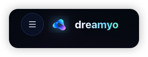
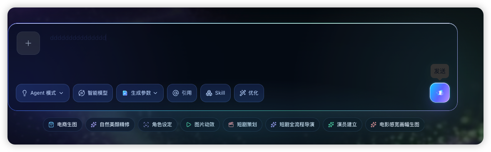
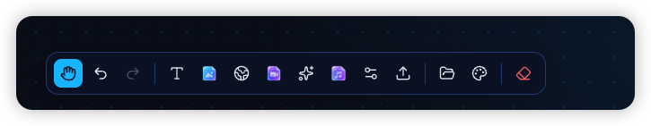
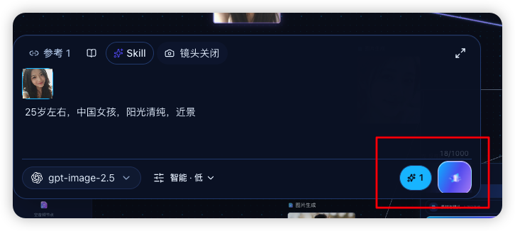
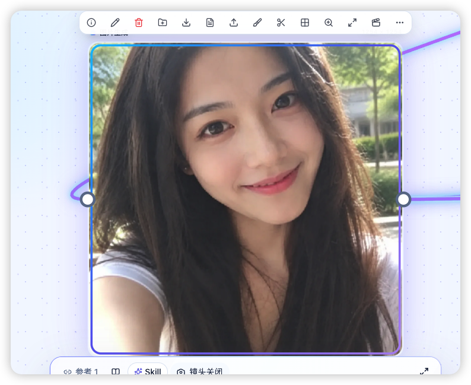
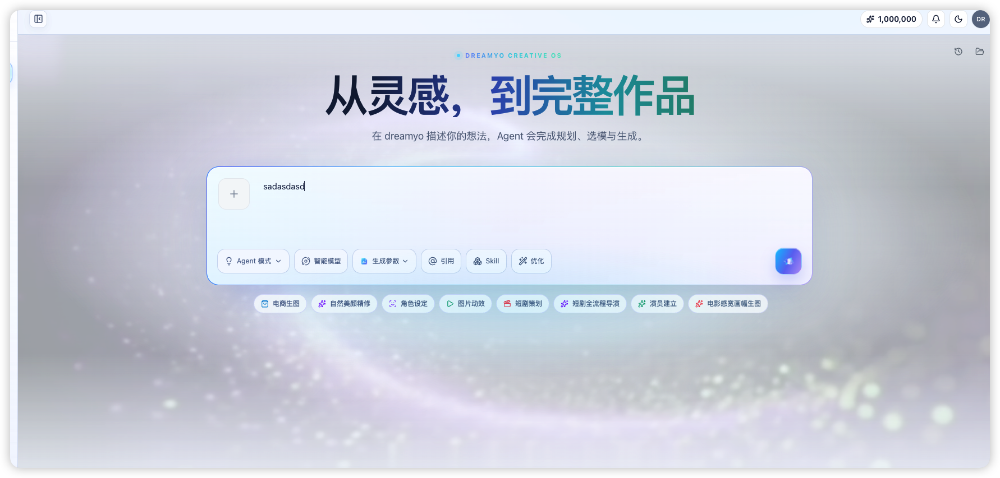
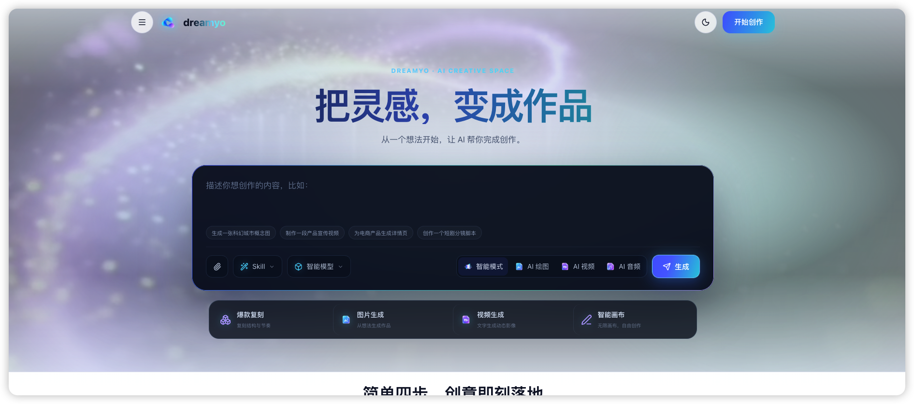
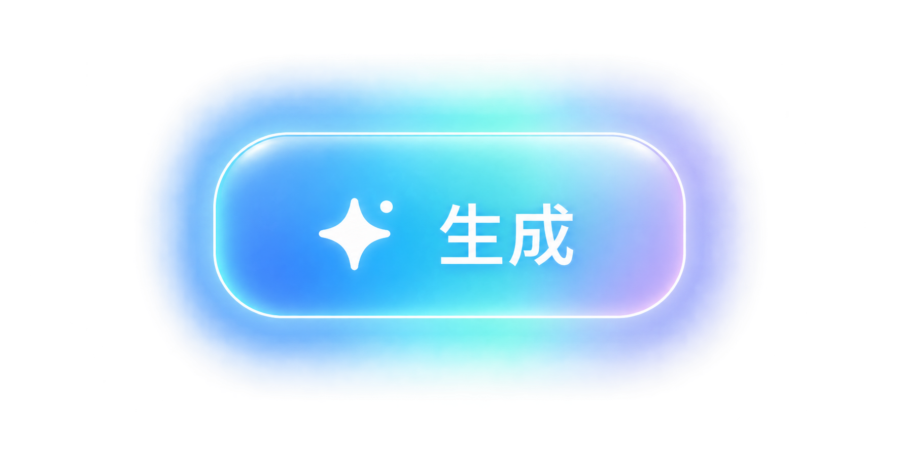
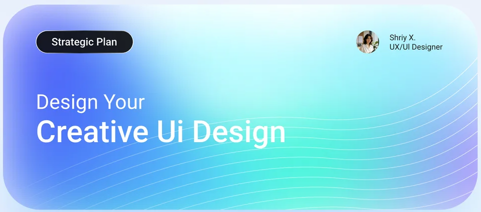

# 8 项问题与证据

本次审查使用用户本轮明确提供的截图与当前源码；未启动新浏览器流程，不能据此宣称运行态已修复。截图01—07为问题证据；旧08已被本轮B01替代，C01为新增全站配色目标。已查明的源码冲突与待验证的运行原因分别记录。

## D01 · 深色 Logo 出现方块背景 · P1 · OPEN

- 观察与源码证据：site-logo.tsx 两个主题默认均指向 mark.png；同一 className 同时传给外层 span 和 img；home.module.css 的 brandLogo 添加双 drop-shadow。现有 mark.png 为 1254×1254，约72.91%像素全透明，因此“源文件完全不透明”并不成立。截图的实际 currentSrc、自定义配置与叠层仍待定位。
- 实施方向：当前页面真实 src/currentSrc、网络资源、背景与滤镜、Alpha 内容、外层/内层重复 class 均检查；先定位再修，不能仅换另一个带透明通道的文件。
- 验收条件：白、浅蓝、深蓝、黑、棋盘底合成，无可见方形底块；默认/自定义/失败回退、刷新/切换一致。
- 状态限制：此处未提供修复后截图或浏览器通过记录。

## D02 · 深色输入文字与光标不可辨 · P1 · OPEN

- 观察与源码证据：create-studio.module.css 的 landingComposer creative-composer-input 在普通/聚焦/键盘聚焦状态均强制 color:#16213d !important；placeholder 有深色分支但正文没有。截图无法确定是否聚焦，光标不可见需实测 focus、caret-color 和遮罩。
- 实施方向：移除无主题限定的正文颜色强覆盖；深浅输入、光标、选中文本与 placeholder 各自定义，检查 readonly/disabled 和 pointer-events。
- 验收条件：输入中文英文、移动光标、选择/粘贴均可见；活动元素正确；两主题正文对比和光标存在通过。
- 状态限制：此处未提供修复后截图或浏览器通过记录。

## D03 · Canvas 工具栏彩色/单色混用 · P2 · OPEN

- 观察与源码证据：canvas-toolbar.tsx 把 image/video/audio 换成 Dreamyo PNG，其余为 Lucide；global-product-design.css 又把 PNG 统一改22px。此处属于高频紧凑工具，不适合不一致的插画。
- 实施方向：本工具栏统一 Lucide：Image/Video/Music2，与现有 Type、Hand 等同尺寸/笔画；移除该 toolbar 的 PNG 放大覆盖。
- 验收条件：全部图标光学尺寸一致；状态通过中性色/主题色表达；提供语义名称和键盘操作。
- 状态限制：此处未提供修复后截图或浏览器通过记录。

## D04 · 节点生成按钮模糊且被裁切 · P1 · OPEN

- 观察与源码证据：全局 icon 按钮固定48×48且 min-height46；节点底栏 h-12、border-t、pt-1、overflow-hidden，可用内高小于48。外层 Canvas 还会变换坐标；PNG 本体占位小。
- 实施方向：统一按钮变体；节点紧凑40px，底栏56px且计算内高；右侧动作不得收缩。检查每一层 overflow、缩放和悬浮工具遮挡。
- 验收条件：按钮完整可见可点；实际四角与中心均命中按钮/子节点；100%与缩放、长模型名及窄屏不裁切。
- 状态限制：此处未提供修复后截图或浏览器通过记录。

## D05 · 节点选中边框内缩，未包住图片 · P1 · OPEN

- 观察与源码证据：canvas-node.tsx SVG rect 在100坐标系中以0.8和98.4内缩；preserveAspectRatio=none 使横纵内缩随媒体尺寸变化。图片圆角与SVG圆角亦不同。
- 实施方向：边框绑定媒体壳最外边界，以实际尺寸和相同圆角呈现；消除百分比内缩。媒体裁切层与选中/端口层分离，装饰不能截获指针。
- 验收条件：四边相对真实媒体外缘偏差≤1屏幕CSS px；大/小/宽/高/批次节点、缩放拖拽后保持一致；端口可连线。
- 状态限制：此处未提供修复后截图或浏览器通过记录。

## D06 · 浅色动态背景灰蒙、雾化 · P2 · OPEN

- 观察与源码证据：首页与/create复用 particle-infinity.mp4；CSS有hue-rotate/brightness/blur和白色veil、多层bloom叠加。源码支持灰雾来源推断，具体时序仍需运行验证。
- 实施方向：浅色独立素材与合成方案；冷白为主，品牌青紫位于边缘；减少动态与素材失败直接静态降级，正文/面板不参与滤镜。
- 验收条件：首屏清晰，没有全屏灰幕；动态三个时点可读性一致；reduced-motion无持续漂移；输入滚动无明显卡顿。
- 状态限制：此处未提供修复后截图或浏览器通过记录。

## D07 · 首页浅色输入与快捷面板仍为深色 · P1 · OPEN

- 观察与源码证据：home-agent-hero.module.css 的默认 --hero-panel 为rgba(4,13,31,.92)、soft为rgba(10,25,48,.78)，多处 picker/control 也硬编码深底。独立首页并未由/create修复覆盖。
- 实施方向：建立首页浅深完整变量，覆盖输入、建议词、模式、Skill/模型弹层、快捷面板，而非仅父容器背景。
- 验收条件：匿名首页浅色全部面板/弹层浅底深字；深色各状态可读；登录跳转仍携带草稿与真实选择。
- 状态限制：此处未提供修复后截图或浏览器通过记录。

## D08 · 所有生成动作采用新B01 · P1 · OPEN

- 观察与源码证据：本轮B01为1774×887透明PNG，约50.03%像素完全透明；白星与“生成”已烘焙在图内。现有magic.png与B01语义/清晰度不一致；首页仍有独立Send按钮。
- 实施方向：B01原图留存，制作无文字底板、白星独立清晰派生；所有调用点按variant与label接入；积分单独作为成本提示，运行/停止为真实状态。
- 验收条件：三种规格、中文文案与DPR1/2清晰；只有一个主状态图标；无拉伸文字，无重复积分星，loading仅一个转圈。
- 状态限制：此处未提供修复后截图或浏览器通过记录。

## C01 · 全站配色依据 · 新增设计约束 · 待实施

图像962×425，为不透明参考卡片。借鉴左侧蓝色、中央青/薄荷、右侧淡紫与顶部冰白的层次；不导入图中英文、人物、署名或品牌。应用范围包含所有用户页、后台、弹层、Canvas、状态及文档；细则见06和A17。旧08图片仍保留，已在manifest标记superseded_by=B01。
